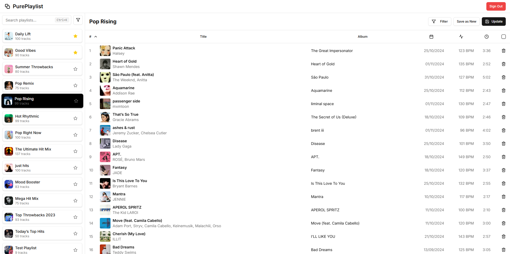

# PurePlaylist

PurePlaylist is a web application that helps users organize and manage their Spotify playlists with ease. It provides a user-friendly interface for sorting, filtering, and manipulating playlist tracks.

## Features

-   **Keyword Filtering**: Filter songs by specific keywords in titles, genres, or artist names.
-   **Artist and Genre Filtering**: Narrow down your playlist by selecting or excluding artists and genres.
-   **User-Friendly Interface**: Intuitive modal-based filtering options for seamless interaction.
-   **Responsive Design**: Works across all devices—desktop, tablet, and mobile.

## Technologies Used

-   **React**: Component-based UI library for building user interfaces.
-   **Next.js**: Server-side rendering and static site generation framework.
-   **Tailwind CSS**: Utility-first CSS framework for styling the app.
-   **Spotify API**: Fetch and manage playlist data from Spotify.
-   **Shadcn**: UI component library for enhancing the user experience.
-   **React Query (TanStack Query)**: Efficient data fetching and state management.
-   **Next-Auth**: Spotify authentication.

## Usage

1. Log in with your Spotify account
2. Browse your playlists in the grid view
3. Select a playlist to view and manage its tracks
4. Use the sort and filter options to organize tracks
5. Create new playlists or modify existing ones
6. Enjoy your perfectly organized music library!

## Screenshot

